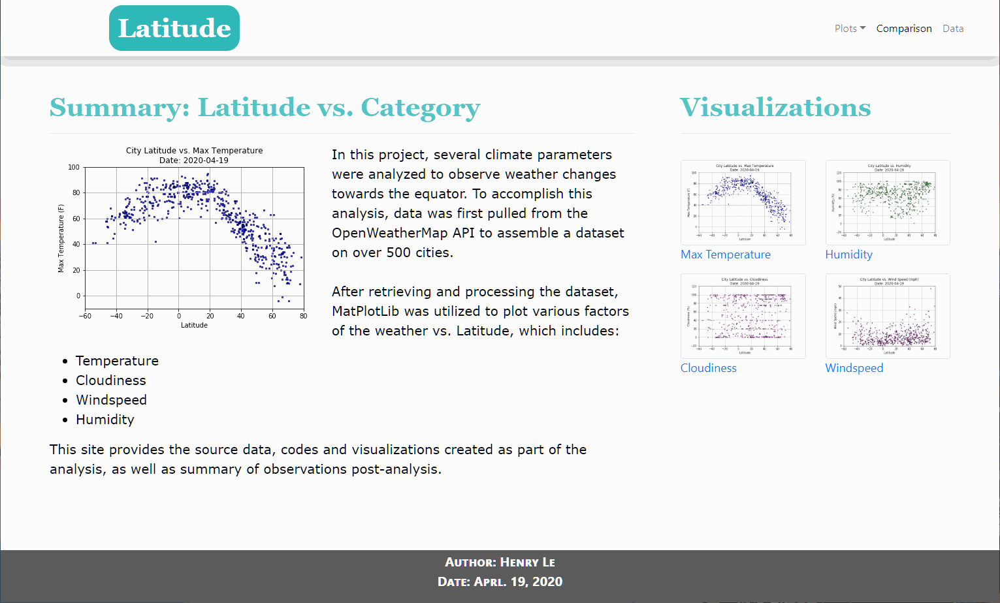

# Effects of Latitude on Climate
## 1. Background
It's too hot at the equator, should it be cooler if traveling North? Many will answer yes as a common sense; equator should be the hottest place on Earth. In this project, weather of more than 500 cities were analyzed to investigate how weather is changing with latitudes and help answer this question. All results and graphs are published online for public access through GitHub IO.
  

#### Quick Demo:

  

## 2. Website Deployment:
As this is a simple website with multiple webpages, GitHub IO is chosen for simplicity. All webpages are fully functional and inter-connected where different data types can be accessed clicking at different buttons & graphs. Bootstrap grid system is ultilized to automatically reformat the contents for different screen sizes from large (TVs, big monitors, etc.) to xtra small devices (cellphones, small tablets, etc.)

<a href="https://henryle-n.github.io/Latitude-Effects-on-Climate/weather-analysis/index.html  ">Click here</a> to access the website.

  
## 3. Languages, Tools & Techniques  
* Languages:
  * HTML5 | CSS3 | Python 
* Python Libraries:
  * Pandas (CSV to DataFrame & DataFrame to HTML)
* Software/ Applications:
  * Jupyter Notebook | Google Chrome ver. 84 | Visual Studio Code | Git Bash | Windows Terminal | Python Server
* HTML/ CSS Libraries:
  * <a href="https://getbootstrap.com/docs/4.5/getting-started/introduction/">Bootstrap-4:</a>  
    * *Navbar*: collapsible navigation bar depending on screen size with "_Hamburger_" menu button
    * *Flexbox*: for page footer  
    * *Grid System*: screen-adaptive content formating
    * *Tables*: interative table with sliding bar for hidding overflow data
  

## 4. Table of Contents  
* **Data:** original CSV climate data of all analyzed cities around the world.
* **Jupyter Notebook:** brought in CSV and convert to HTML table, which is used for _Data.html_.
* **static:**
  * **/css/style.css** : CSS for all webpages.
  * **/images**: all pictures showing on each webpage and Readme.
* **weather-analysis:** all webpages of this project: 
  * **Cloudiness.html**: shows cloudiness vs. latitudes graphs and analysis.  
  * **Comparison.html**: shows all plotted parameters vs. latitudes for easy comparison between different categories.
  * **Data.html**: shows all raw data in an easy-to-read format.
  * **Humidity.html**: shows humidity vs. latitudes graphs and analysis.  
  * **Temperature.html**: shows temperature vs. latitudes graphs and analysis.  
  * **Windspeed.html**: shows windspeed vs. latitudes graphs and analysis. 
  * **index.html**: main webpage. 

## 5. Summary
### Website Development
* HTML provides the skeleton to layout the web content.
* BootStrap and CSS provide easy custom formats and decorations.
  * Mouse hovering effects (halo ring around graphs, highlighted table cells, link underlines).
  * Flexible table with auto hidden overflow data.
* Fully connected website utilizing simple `<a>` tag for referencing relative links to other webpages.
* Collapsible Navigation Bar & background color change as per screen size (pixel-driven).  

### Data Analysis
* Among all climate parameters, latitude effects on temperature is very obvious. Temperature drops as going away from the equator.
* Yet, all other parameters don't have any definite trend.
 
## 6. How to Use
All source codes are store in this repository. To download to local PC:
* `git clone https://github.com/henryle-n/Latitude-Effects-on-Climate.git` 
* Make sure Bootstrap API and style sheet links are correct.
* Highly recommend to check out Bootstrap official website and documentation <a href="https://getbootstrap.com/docs/4.5/getting-started/introduction/">(access here)</a>. This library contains many features that can beautify a variety of web designs & increase work efficiency for web developers.
